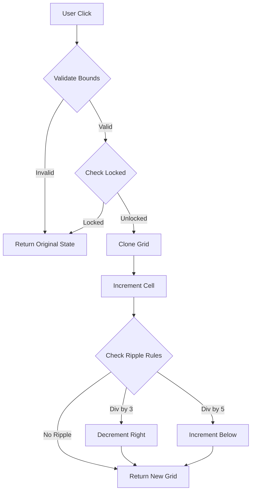

# The Recursive Grid

A 3x3 grid-based logic game built with Next.js 14 and Tailwind CSS.
Strict adherence to pure functional programming and immutable state principles.

## Game Rules

1. **Initial State**: All 9 cells start at `0`.
2. **Increment**: Clicking a cell adds `+1` to its value.
3. **Ripple (Divisible by 3)**: If a cell becomes divisible by 3, its **RIGHT** neighbor decrements by `1`.
4. **Ripple (Divisible by 5)**: If a cell becomes divisible by 5, its **BELOW** neighbor increments by `2`.
5. **Locking**: If a cell reaches `15` or higher, it becomes **LOCKED** (Turn Red).
    - Locked cells cannot be clicked.
    - Locked cells cannot be modified by ripples.
6. **Boundaries**: Ripples that go out of bounds are ignored (no crash).

## Architectural Decisions

- **State Representation**: `number[][]` for O(1) access and direct mapping to the grid UI.
- **Derived State**: `locked` status is derived on-the-fly (`value >= 15`) to prevent state desynchronization.
- **Single-Trigger Ripple**: Ripple logic is strictly single-step (no cascading) to maintain predictable complexity.
- **Boundary Guards**: Validated before cloning to prevent unnecessary object creation.
- **Immutability**: Enforced using map-spread cloning to support history/undo features in the future.

## Game Flow



*Note: The flow strictly follows a validate-clone-modify pattern to ensure no side effects ensue on the original state reference.*

### Tech Stack
- **Framework**: Next.js 14 (App Router)
- **Styling**: Tailwind CSS (Utility-first)
- **Testing**: Jest (Unit & Logic Validation)

## Setup & Run

```bash
# Install dependencies
npm install

# Run development server
npm run dev

# Run test suite
npm test
```

## Project Structure

```
app/
  gameState.js    # Core pure logic (Audit Verified)
  page.js         # UI Component
__tests__/
  gameState.test.js # Comprehensive Test Suite
docs/
  test-suite.md   # Manual Test Cases (0-based)
  test-plan.md    # Original Test Plan
```

## ✅ Behavioral Validation

This project includes a full behavioral test plan covering:

- **Ripple Logic**: Validates 3-rule (right decrement) and 5-rule (bottom increment).
- **Combined Rules**: Ensures 15 triggers both effects correctly.
- **Locked State Enforcement**: Verifies locked cells are immune to clicks and ripples.
- **Boundary Protection**: Ensures edge clicks (col 2, row 2) don't crash the app.
- **Immutability Guarantees**: Confirms state transitions return new references (or same reference for no-ops).
- **Complex Sequences**: Validates cumulative math and recursion prevention.

See [`docs/test-suite.md`](docs/test-suite.md) for full coverage details.

## 🧪 Running Tests

We use Jest for unit testing the pure game logic.

```bash
npm test              # Run all tests
npm run test:watch    # Interactive mode
npm run test:coverage # Generate coverage report
```

Current Status: **34/34 Tests Passing** (100% Logic Coverage)
